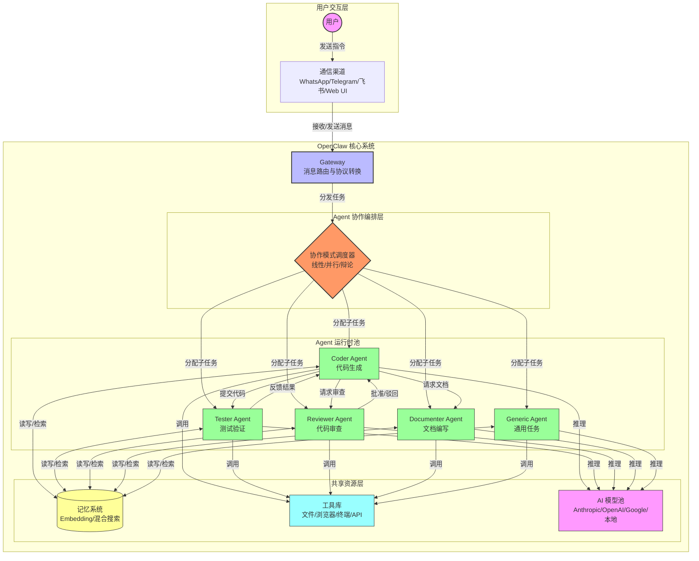
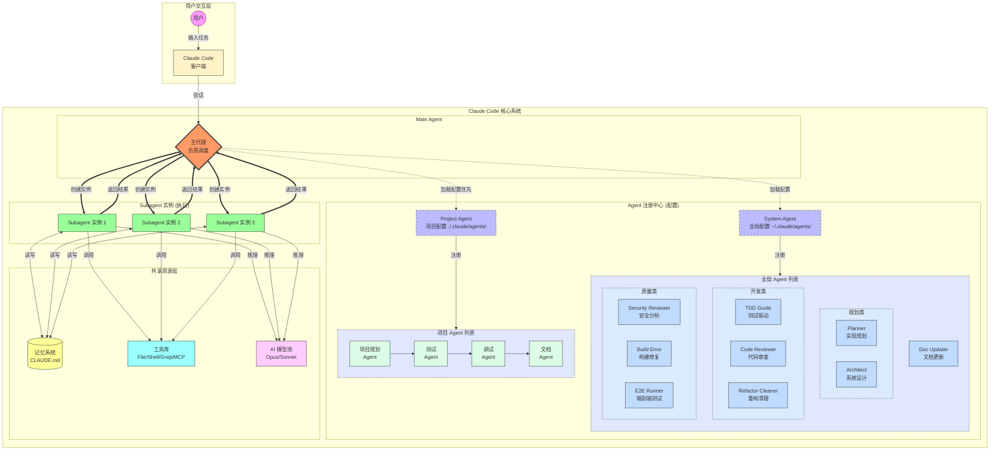
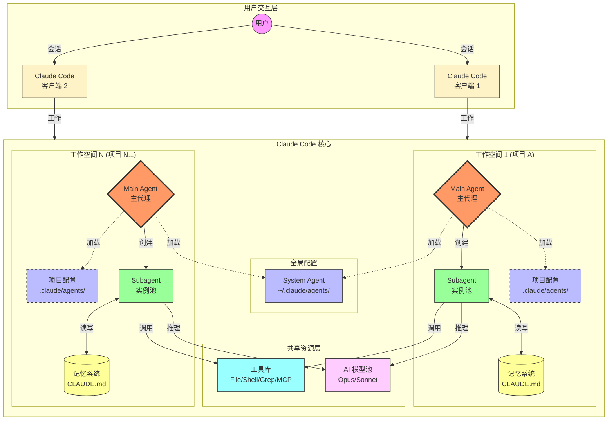
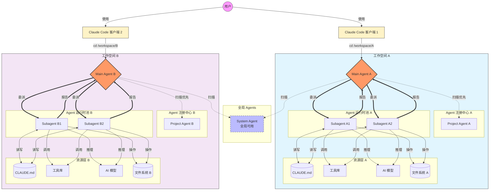

# **OpenClaw** 多agent 执行时的架构流程

OpenClaw 在创建 agent 时，为每个agent创建独立的workspace

# Claude  Runner

## Claude  Runner 单项目

单独的项目在独立的目录运行，有系统级的配置，也支持项目级的配置，项目级的 skill 会覆盖系统级的 skill

## Claude  Runner 多项目

## Claude  Runner 多项目多agnet完整版

