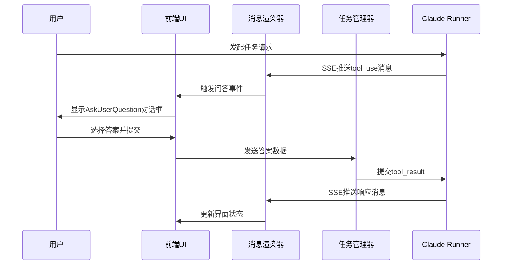

# AskUserQuestion多轮对话技术设计文档

## 1. 概述

本文档详细描述AskUserQuestion工具在多轮对话场景下的技术设计方案，包括系统架构、数据结构、交互流程、状态管理等核心技术实现细节。

## 2. 系统架构设计

### 2.1 整体架构图
```
[用户界面] ↔ [消息渲染器] ↔ [任务管理器] ↔ [Claude Runner]
     ↑              ↑              ↑              ↑
[对话框组件]    [SSE流处理]    [状态管理]    [AI模型交互]
```

### 2.2 核心组件职责

#### 2.2.1 前端组件
- **AskUserQuestionDialog**: 对话框UI组件，负责用户交互
- **MessageRenderer**: 消息渲染引擎，处理SSE流数据
- **TaskManager**: 任务状态协调器，管理会话生命周期

#### 2.2.2 后端服务
- **ClaudeRunner**: AI模型调用核心，处理工具调用逻辑
- **SessionManager**: 会话状态管理，维护对话上下文
- **WebSocket/SSE**: 实时通信通道，推送对话状态

## 3. 数据结构设计

### 3.1 核心数据模型

#### 3.1.1 问答数据结构
```python
@dataclass
class QuestionOption:
    """问题选项定义"""
    id: str
    label: str
    description: Optional[str] = None
    default: bool = False

@dataclass
class FollowUpQuestion:
    """后续问题定义"""
    question_id: str
    question_text: str
    type: str
    options: Optional[list[QuestionOption]] = None

@dataclass
class AskUserQuestion:
    """用户问答核心数据结构"""
    question_id: str
    question_text: str
    type: str  # multiple_choice, checkbox, text, boolean
    header: Optional[str] = None
    description: Optional[str] = None
    options: Optional[list[QuestionOption]] = None
    required: bool = True
    follow_up_questions: dict[str, list[FollowUpQuestion]] = field(default_factory=dict)
```

#### 3.1.2 会话状态结构
```python
@dataclass
class SessionState:
    """会话状态管理"""
    session_id: str
    status: str  # active, completed, timeout
    current_questions: list[str]  # 当前活跃的问答ID列表
    answered_questions: dict[str, Any]  # 已回答问题记录
    created_at: datetime
    last_activity: datetime
```

### 3.2 消息传输格式

#### 3.2.1 工具调用消息
```json
{
  "type": "tool_use",
  "id": "call_function_xxx",
  "name": "ask_user_question",
  "input": {
    "question_id": "功能选择",
    "header": "选择功能",
    "question_text": "请选择一个功能",
    "type": "multiple_choice",
    "options": [
      {
        "id": "poem",
        "label": "背唐诗",
        "description": "背诵一首经典唐诗"
      }
    ],
    "required": true
  }
}
```

#### 3.2.2 工具结果消息
```json
{
  "type": "tool_result",
  "tool_use_id": "call_function_xxx",
  "content": "User has answered your questions: \"请选择一个功能\"=\"背唐诗\""
}
```

## 4. 交互流程设计

### 4.1 标准对话流程

#### 4.1.1 发起问答流程


#### 4.1.2 多轮对话处理
```
第一轮问答 → 用户回答 → 系统确认 → 第二轮问答 → 用户回答 → 系统确认 → ... → 最终执行
```

### 4.2 状态转换机制

#### 4.2.1 单轮对话状态机
```
pending → showing → answered → processing → completed/error
```

#### 4.2.2 多轮对话状态管理
```
会话状态: active
├── 问答1: pending → answered
├── 问答2: pending → answered  
├── 问答3: pending → answered
└── 最终状态: executing/completed
```

## 5. 技术实现细节

### 5.1 前端实现

#### 5.1.1 对话框组件设计
```javascript
const AskUserQuestionDialog = {
    _currentQuestion: null,
    _sessionId: null,
    _callbacks: {},
    
    /**
     * 显示问答对话框
     * @param {Object} runner - ClaudeCodeRunner 实例
     * @param {Object} questionData - 问题数据
     * @param {string} sessionId - 会话ID
     */
    show(runner, questionData, sessionId) {
        this._currentQuestion = questionData;
        this._sessionId = sessionId;
        this._runner = runner; // 保存runner引用用于答案提交

        // 创建对话框元素
        const dialogEl = this._createDialogElement(questionData);
        runner.outputEl.appendChild(dialogEl);

        // 滚动到底部
        Utils.scrollToBottom(runner.outputEl);
    },
    
    /**
     * 创建对话框DOM元素
     * @param {Object} questionData - 问题数据
     * @returns {HTMLElement} 对话框元素
     */
    _createDialogElement(questionData) {
        const dialog = document.createElement('div');
        dialog.className = 'ask-user-question-dialog';
        dialog.innerHTML = `
            <div class="dialog-header">
                <h3>${questionData.header || questionData.question_text}</h3>
            </div>
            <div class="dialog-content">
                ${this._renderOptions(questionData)}
            </div>
            <div class="dialog-footer">
                <button class="btn-primary" onclick="this.submitAnswer()">确定</button>
                <button class="btn-secondary" onclick="this.cancelDialog()">取消</button>
            </div>
        `;
        return dialog;
    },
    
    /**
     * 渲染选项列表
     * @param {Object} questionData - 问题数据
     * @returns {string} 选项HTML
     */
    _renderOptions(questionData) {
        const isCheckbox = questionData.type === 'checkbox';
        const options = questionData.options || [];

        return options.map(opt => `
            <label class="option-item ${isCheckbox ? 'checkbox' : 'radio'}">
                <input
                    type="${isCheckbox ? 'checkbox' : 'radio'}"
                    name="question_${questionData.question_id}"
                    value="${Utils.escapeHtml(opt.id)}"
                    ${opt.default ? 'checked' : ''}
                >
                <span class="option-label">${Utils.escapeHtml(opt.label)}</span>
                ${opt.description ? `<span class="option-description">${Utils.escapeHtml(opt.description)}</span>` : ''}
            </label>
        `).join('');
    },
};
```

#### 5.1.2 SSE消息处理
```javascript
class MessageRenderer {
    /**
     * 处理AskUserQuestion工具调用消息
     * @param {Object} message - SSE消息
     */
    handleAskUserQuestion(message) {
        const questionData = this._parseQuestionData(message);
        const sessionId = this._getCurrentSessionId();
        
        // 触发对话框显示
        AskUserQuestionDialog.show(this.runner, questionData, sessionId);
        
        // 更新任务状态
        this.taskManager.updateQuestionStatus(message.id, 'showing');
    }
    
    /**
     * 解析问题数据
     * @param {Object} message - 工具调用消息
     * @returns {Object} 标准化的问题数据
     */
    _parseQuestionData(message) {
        const input = message.input;
        return {
            question_id: input.question_id,
            header: input.header,
            question_text: input.question_text,
            type: input.type,
            options: input.options || [],
            multiSelect: input.multiSelect || false,
            required: input.required !== false
        };
    }
}
```

### 5.2 后端实现

#### 5.2.1 工具调用识别
```python
class ClaudeRunner:
    def _handle_tool_calls(self, tool_calls):
        """处理工具调用"""
        for tool_call in tool_calls:
            if self._is_ask_user_question(tool_call):
                await self._process_ask_user_question(tool_call)
    
    def _is_ask_user_question(self, tool_call):
        """识别AskUserQuestion工具调用"""
        tool_name_lower = tool_call.name.lower()
        # 支持多种名称格式
        if tool_name_lower in ("ask_user_question", "askuserquestion", "askuser"):
            return True
        return False
    
    async def _process_ask_user_question(self, tool_call):
        """处理用户问答请求"""
        question_data = await self._parse_question_data(tool_call.input)
        
        # 生成唯一标识
        question_id = f"{tool_call.id}_{int(time.time())}"
        
        # 发送SSE消息到前端
        await self._send_sse_message({
            'type': 'ask_user_question',
            'question': question_data,
            'question_id': question_id,
            'session_id': self.session_id
        })
```

#### 5.2.2 答案处理机制
```python
class SessionManager:
    async def handle_question_answer(self, session_id, question_id, answer):
        """处理用户答案"""
        # 验证会话和问题状态
        if not self._validate_session(session_id):
            raise ValueError("Invalid session")
            
        if not self._validate_question_status(question_id, 'showing'):
            raise ValueError("Question not in showing state")
        
        # 存储答案
        self._store_answer(session_id, question_id, answer)
        
        # 更新状态
        self._update_question_status(question_id, 'answered')
        
        # 通知Claude Runner处理答案
        await self.claude_runner.process_answer(
            session_id, question_id, answer
        )
```

## 6. 并发控制与资源管理

### 6.1 并发限制策略
```python
class ConcurrencyManager:
    def __init__(self):
        self.max_concurrent_questions = 5
        self.active_questions = {}
        self.question_queue = deque()
    
    async def acquire_question_slot(self, session_id, question_id):
        """获取问答执行槽位"""
        if len(self.active_questions) >= self.max_concurrent_questions:
            # 加入队列等待
            await self.question_queue.append((session_id, question_id))
            return False
        
        self.active_questions[question_id] = {
            'session_id': session_id,
            'start_time': time.time()
        }
        return True
    
    async def release_question_slot(self, question_id):
        """释放问答执行槽位"""
        if question_id in self.active_questions:
            del self.active_questions[question_id]
            
        # 处理队列中的等待项
        if self.question_queue:
            next_item = await self.question_queue.popleft()
            await self.acquire_question_slot(next_item[0], next_item[1])
```

### 6.2 内存管理机制
```python
class MemoryManager:
    def __init__(self):
        self.max_session_memory = 100 * 1024 * 1024  # 100MB
        self.session_data = {}
        self.cleanup_interval = 300  # 5分钟
    
    def store_session_data(self, session_id, data):
        """存储会话数据并检查内存使用"""
        data_size = sys.getsizeof(data)
        current_usage = sum(sys.getsizeof(d) for d in self.session_data.values())
        
        if current_usage + data_size > self.max_session_memory:
            self._cleanup_old_sessions()
        
        self.session_data[session_id] = {
            'data': data,
            'size': data_size,
            'last_access': time.time()
        }
    
    def _cleanup_old_sessions(self):
        """清理过期会话数据"""
        current_time = time.time()
        expired_sessions = [
            sid for sid, info in self.session_data.items()
            if current_time - info['last_access'] > 3600  # 1小时未访问
        ]
        
        for session_id in expired_sessions:
            del self.session_data[session_id]
```

## 7. 性能优化策略

### 7.1 响应时间优化
```javascript
// 前端性能优化
class PerformanceOptimizer {
    constructor() {
        this.responseTimings = [];
        this.maxTimingRecords = 1000;
    }
    
    measureResponse(start, end, operation) {
        const duration = end - start;
        this.responseTimings.push({
            operation,
            duration,
            timestamp: Date.now()
        });
        
        // 保持记录数量限制
        if (this.responseTimings.length > this.maxTimingRecords) {
            this.responseTimings.shift();
        }
        
        // 性能告警
        if (duration > 200) {
            console.warn(`Slow operation detected: ${operation} took ${duration}ms`);
        }
    }
    
    getPerformanceMetrics() {
        const recentTimings = this.responseTimings.slice(-100);
        return {
            avgResponseTime: this._calculateAverage(recentTimings),
            p95ResponseTime: this._calculatePercentile(recentTimings, 95),
            slowOperations: recentTimings.filter(t => t.duration > 200).length
        };
    }
}
```

### 7.2 缓存策略
```python
class CacheManager:
    def __init__(self):
        self.question_cache = {}
        self.cache_ttl = 300  # 5分钟
    
    def cache_question_template(self, question_id, template):
        """缓存问题模板"""
        self.question_cache[question_id] = {
            'template': template,
            'cached_at': time.time(),
            'hit_count': 0
        }
    
    def get_cached_question(self, question_id):
        """获取缓存的问题模板"""
        if question_id in self.question_cache:
            cached = self.question_cache[question_id]
            if time.time() - cached['cached_at'] < self.cache_ttl:
                cached['hit_count'] += 1
                return cached['template']
            else:
                del self.question_cache[question_id]
        return None
```

## 8. 安全与权限控制

### 8.1 输入验证机制
```python
class InputValidator:
    def __init__(self):
        self.max_input_length = 1000
        self.allowed_chars = set(string.printable)
    
    def validate_question_options(self, options):
        """验证问题选项"""
        if not isinstance(options, list):
            raise ValueError("Options must be a list")
        
        for option in options:
            if not isinstance(option, dict):
                raise ValueError("Each option must be a dictionary")
            
            if 'label' not in option:
                raise ValueError("Option must have a label")
            
            if len(option['label']) > 50:
                raise ValueError("Option label too long")
            
            # 字符安全检查
            if not all(c in self.allowed_chars for c in option['label']):
                raise ValueError("Invalid characters in option label")
    
    def sanitize_user_input(self, input_text):
        """清理用户输入"""
        # 移除潜在危险字符
        dangerous_chars = ['<', '>', '&', '"', "'", '`']
        sanitized = input_text
        for char in dangerous_chars:
            sanitized = sanitized.replace(char, '')
        
        # 限制长度
        return sanitized[:self.max_input_length]
```

### 8.2 会话权限管理
```python
class SessionSecurity:
    def __init__(self):
        self.session_timeout = 3600  # 1小时
        self.max_sessions_per_user = 10
    
    def validate_session_access(self, session_id, user_id):
        """验证会话访问权限"""
        session = self.get_session(session_id)
        if not session:
            return False
            
        if session.user_id != user_id:
            raise PermissionError("Session access denied")
            
        if time.time() - session.last_activity > self.session_timeout:
            self.expire_session(session_id)
            return False
            
        return True
    
    def rate_limit_check(self, user_id):
        """检查用户请求频率"""
        user_sessions = self.get_user_sessions(user_id)
        if len(user_sessions) > self.max_sessions_per_user:
            raise RateLimitExceeded("Too many active sessions")
```

## 9. 错误处理与恢复

### 9.1 异常处理机制
```python
class ErrorHandler:
    def __init__(self):
        self.error_handlers = {}
        self.retry_policies = {}
    
    def register_error_handler(self, error_type, handler):
        """注册错误处理器"""
        self.error_handlers[error_type] = handler
    
    async def handle_error(self, error, context):
        """处理错误"""
        error_type = type(error).__name__
        
        if error_type in self.error_handlers:
            handler = self.error_handlers[error_type]
            return await handler(error, context)
        else:
            # 默认错误处理
            logger.error(f"Unhandled error: {error}", extra=context)
            return self._default_recovery(context)
    
    def _default_recovery(self, context):
        """默认恢复策略"""
        return {
            'status': 'error',
            'message': 'An unexpected error occurred',
            'recovery_action': 'restart_session'
        }
```

### 9.2 会话恢复机制
```python
class SessionRecovery:
    def __init__(self):
        self.checkpoint_interval = 30  # 30秒保存一次检查点
    
    def create_checkpoint(self, session_id, state):
        """创建会话检查点"""
        checkpoint = {
            'session_id': session_id,
            'state': state,
            'timestamp': time.time(),
            'version': self._generate_version()
        }
        
        # 存储检查点
        self.storage.save_checkpoint(checkpoint)
        return checkpoint['version']
    
    def restore_session(self, session_id, checkpoint_version=None):
        """恢复会话"""
        if checkpoint_version:
            checkpoint = self.storage.get_checkpoint(session_id, checkpoint_version)
        else:
            checkpoint = self.storage.get_latest_checkpoint(session_id)
        
        if not checkpoint:
            raise SessionNotFoundError("No checkpoint found")
        
        # 恢复会话状态
        restored_state = checkpoint['state']
        restored_state['restored_at'] = time.time()
        restored_state['restore_reason'] = 'manual_recovery'
        
        return restored_state
```

## 10. 监控与日志

### 10.1 性能监控
```python
class PerformanceMonitor:
    def __init__(self):
        self.metrics = {
            'question_response_time': [],
            'session_duration': [],
            'concurrent_questions': [],
            'error_rates': []
        }
    
    def record_metric(self, metric_name, value, tags=None):
        """记录性能指标"""
        if metric_name in self.metrics:
            self.metrics[metric_name].append({
                'value': value,
                'timestamp': time.time(),
                'tags': tags or {}
            })
    
    def get_metrics_summary(self, time_window=3600):
        """获取指标摘要"""
        summary = {}
        cutoff_time = time.time() - time_window
        
        for metric_name, records in self.metrics.items():
            recent_records = [r for r in records if r['timestamp'] > cutoff_time]
            if recent_records:
                values = [r['value'] for r in recent_records]
                summary[metric_name] = {
                    'count': len(values),
                    'avg': statistics.mean(values),
                    'min': min(values),
                    'max': max(values),
                    'p95': self._percentile(values, 95)
                }
        
        return summary
```

### 10.2 日志记录规范
```python
import logging
import json

class AuditLogger:
    def __init__(self):
        self.logger = logging.getLogger('audit')
        self.log_format = {
            'timestamp': None,
            'session_id': None,
            'user_id': None,
            'action': None,
            'details': None,
            'ip_address': None
        }
    
    def log_question_interaction(self, session_id, user_id, action, details):
        """记录问答交互日志"""
        log_entry = self.log_format.copy()
        log_entry.update({
            'timestamp': datetime.utcnow().isoformat(),
            'session_id': session_id,
            'user_id': user_id,
            'action': action,  # show, answer, cancel, timeout
            'details': details,
            'ip_address': self._get_client_ip()
        })
        
        self.logger.info(json.dumps(log_entry))
    
    def log_security_event(self, event_type, details, severity='medium'):
        """记录安全事件"""
        security_log = {
            'event_type': event_type,
            'severity': severity,
            'details': details,
            'timestamp': datetime.utcnow().isoformat()
        }
        
        if severity == 'high':
            self.logger.critical(json.dumps(security_log))
        elif severity == 'medium':
            self.logger.warning(json.dumps(security_log))
        else:
            self.logger.info(json.dumps(security_log))
```

## 11. 测试策略

### 11.1 单元测试
```python
import unittest
from unittest.mock import Mock, patch

class TestAskUserQuestion(unittest.TestCase):
    def setUp(self):
        self.runner = Mock()
        self.dialog = AskUserQuestionDialog()
    
    def test_single_choice_question(self):
        """测试单选问题"""
        question_data = {
            'question_id': 'test_question',
            'question_text': '选择一个选项',
            'type': 'multiple_choice',
            'options': [
                {'id': 'opt1', 'label': '选项1'},
                {'id': 'opt2', 'label': '选项2'}
            ],
            'required': True
        }
        
        # 模拟用户选择
        with patch('builtins.input', return_value='选项1'):
            result = self.dialog._process_answer(question_data)
            self.assertEqual(result, '选项1')
    
    def test_multi_choice_question(self):
        """测试多选问题"""
        question_data = {
            'question_id': 'test_multi',
            'question_text': '选择多个选项',
            'type': 'checkbox',
            'options': [
                {'id': 'A', 'label': 'A'}, 
                {'id': 'B', 'label': 'B'}, 
                {'id': 'C', 'label': 'C'}
            ],
            'required': True
        }
        
        # 模拟用户多选
        with patch('builtins.input', return_value=['A', 'C']):
            result = self.dialog._process_answer(question_data)
            self.assertEqual(result, ['A', 'C'])
```

### 11.2 集成测试
```python
class IntegrationTests:
    def test_full_conversation_flow(self):
        """测试完整对话流程"""
        # 模拟完整的多轮对话场景
        conversation_steps = [
            # 第一轮问答
            {
                'input': {
                    'question': '选择功能', 
                    'options': [
                        {'id': 'poem', 'label': '背唐诗'}, 
                        {'id': 'joke', 'label': '讲笑话'}
                    ]
                },
                'expected_output': 'poem'
            },
            # 第二轮问答
            {
                'input': {
                    'question': '选择诗人', 
                    'options': [
                        {'id': 'libai', 'label': '李白'}, 
                        {'id': 'dufu', 'label': '杜甫'}
                    ]
                },
                'expected_output': 'libai'
            }
        ]
        
        # 执行测试
        session_id = self.create_test_session()
        for step in conversation_steps:
            question_id = self.send_question(session_id, step['input'])
            answer = step['expected_output']
            result = self.submit_answer(session_id, question_id, answer)
            assert result.status == 'success'
```

## 12. 部署与运维

### 12.1 配置管理
```yaml
# config.yaml
ask_user_question:
  # 并发控制
  max_concurrent_questions: 5
  max_sessions_per_user: 10
  
  # 超时设置
  question_timeout: 300  # 5分钟
  session_timeout: 3600  # 1小时
  
  # 性能参数
  max_input_length: 1000
  cache_ttl: 300
  
  # 安全设置
  enable_input_validation: true
  rate_limit_requests: 100
  rate_limit_window: 60
```

### 12.2 监控告警
```python
class AlertManager:
    def __init__(self):
        self.alert_rules = {
            'high_error_rate': {
                'threshold': 0.05,  # 5%错误率
                'window': 300,      # 5分钟窗口
                'action': 'notify_admin'
            },
            'slow_response_time': {
                'threshold': 1000,  # 1秒
                'window': 60,       # 1分钟窗口
                'action': 'scale_up'
            }
        }
    
    def check_alerts(self, metrics):
        """检查是否触发告警"""
        for alert_name, rule in self.alert_rules.items():
            if self._should_trigger_alert(metrics, rule):
                self._trigger_alert(alert_name, rule)
```

## 13. 未来扩展方向

### 13.1 功能增强计划
- **智能推荐**：基于用户历史选择推荐选项
- **语音交互**：支持语音问答
- **多语言支持**：国际化本地化
- **个性化定制**：用户偏好学习

### 13.2 技术升级路线
- **AI增强**：集成更智能的对话理解
- **实时协作**：多人同时参与问答
- **离线支持**：本地缓存和同步机制
- **数据分析**：用户行为深度分析

---
*文档版本：1.0*
*最后更新：2026-02-22*
*技术负责人：架构设计团队*